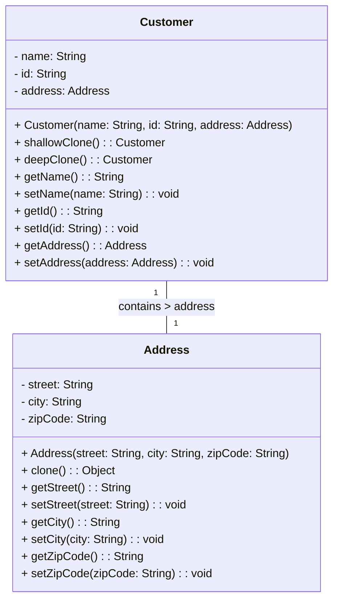

# 作业 创建型模式（三）

### 一、客户类的浅克隆与深克隆实现

#### 1. 类图设计




#### 2. 代码实现

##### Address 类（地址类）

```java
public class Address implements Cloneable {
    private String street;
    private String city;
    private String zipCode;

    public Address(String street, String city, String zipCode) {
        this.street = street;
        this.city = city;
        this.zipCode = zipCode;
    }

    // getter和setter方法
    public String getStreet() { return street; }
    public void setStreet(String street) { this.street = street; }
    public String getCity() { return city; }
    public void setCity(String city) { this.city = city; }
    public String getZipCode() { return zipCode; }
    public void setZipCode(String zipCode) { this.zipCode = zipCode; }

    // 重写clone方法，支持自身克隆
    @Override
    public Object clone() throws CloneNotSupportedException {
        return super.clone();
    }

    @Override
    public String toString() {
        return "Address{street='" + street + "', city='" + city + "', zipCode='" + zipCode + "'}";
    }
}
```

##### Customer 类（客户类）

```java
public class Customer implements Cloneable {
    private String name;
    private String id;
    private Address address;

    public Customer(String name, String id, Address address) {
        this.name = name;
        this.id = id;
        this.address = address;
    }

    // getter和setter方法
    public String getName() { return name; }
    public void setName(String name) { this.name = name; }
    public String getId() { return id; }
    public void setId(String id) { this.id = id; }
    public Address getAddress() { return address; }
    public void setAddress(Address address) { this.address = address; }

    // 浅克隆：仅复制基本类型和引用，引用类型成员指向原对象
    public Customer shallowClone() throws CloneNotSupportedException {
        return (Customer) super.clone();
    }

    // 深克隆：复制引用类型成员（Address对象）
    public Customer deepClone() throws CloneNotSupportedException {
        Customer cloned = (Customer) super.clone();
        cloned.address = (Address) this.address.clone(); // 克隆Address
        return cloned;
    }

    @Override
    public String toString() {
        return "Customer{name='" + name + "', id='" + id + "', address=" + address + "}";
    }
}
```

##### 测试类（CloneTest）

```java
public class CloneTest {
    public static void main(String[] args) throws CloneNotSupportedException {
        // 浅克隆测试
        Address addr1 = new Address("Main St", "Beijing", "100000");
        Customer original1 = new Customer("张三", "C001", addr1);
        Customer shallowClone = original1.shallowClone();

        System.out.println("=== 浅克隆测试 ===");
        System.out.println("原始对象地址：" + original1.getAddress());
        System.out.println("克隆对象地址：" + shallowClone.getAddress());
        original1.getAddress().setCity("Shanghai"); // 修改原始对象的地址
        System.out.println("修改后原始地址：" + original1.getAddress());
        System.out.println("修改后克隆地址：" + shallowClone.getAddress()); // 克隆对象地址也变化

        // 深克隆测试
        Address addr2 = new Address("Oak St", "Guangzhou", "510000");
        Customer original2 = new Customer("李四", "C002", addr2);
        Customer deepClone = original2.deepClone();

        System.out.println("\n=== 深克隆测试 ===");
        System.out.println("原始对象地址：" + original2.getAddress());
        System.out.println("克隆对象地址：" + deepClone.getAddress());
        original2.getAddress().setCity("Shenzhen"); // 修改原始对象的地址
        System.out.println("修改后原始地址：" + original2.getAddress());
        System.out.println("修改后克隆地址：" + deepClone.getAddress()); // 克隆对象地址不变
    }
}
```

#### 3. 浅克隆与深克隆的异同分析

- **相同点**：均会复制对象的基本数据类型成员（如`name`、`id`），生成新的对象实例。

- 不同点

  ：

  - 浅克隆：对于引用类型成员（如`Address`对象），仅复制引用地址，克隆对象与原对象共享该引用类型实例（修改原对象的引用成员会影响克隆对象）。
  - 深克隆：对于引用类型成员，会创建新的实例（通过克隆引用对象），克隆对象与原对象的引用成员完全独立（修改原对象的引用成员不影响克隆对象）。

### 二、多例模式实现

#### 1. 模式设计

多例模式通过限制类的实例数量（如 2 个或 3 个），核心思想与单例模式一致：私有化构造方法，内部维护有限实例，提供静态方法获取实例。

#### 2. 代码实现（限制 3 个实例）

##### 多例类（MultiInstance）

```java
import java.util.HashMap;
import java.util.Map;

public class MultiInstance {
    // 存储有限实例的集合（键为实例标识）
    private static final Map<Integer, MultiInstance> instances = new HashMap<>();
    // 限制最大实例数量为3
    private static final int MAX_INSTANCES = 3;

    // 私有化构造方法，禁止外部创建实例
    private MultiInstance() {}

    // 静态初始化块：创建有限个实例
    static {
        for (int i = 1; i <= MAX_INSTANCES; i++) {
            instances.put(i, new MultiInstance());
        }
    }

    // 静态方法：根据标识获取实例（确保不超过最大数量）
    public static MultiInstance getInstance(int key) {
        if (key < 1 || key > MAX_INSTANCES) {
            throw new IllegalArgumentException("实例标识必须在1-" + MAX_INSTANCES + "之间");
        }
        return instances.get(key);
    }

    // 辅助方法：打印实例唯一标识（哈希码）
    public String getInstanceId() {
        return Integer.toHexString(System.identityHashCode(this));
    }
}
```

##### 测试类（MultiInstanceTest）

```java
public class MultiInstanceTest {
    public static void main(String[] args) {
        // 获取3个实例
        MultiInstance ins1 = MultiInstance.getInstance(1);
        MultiInstance ins2 = MultiInstance.getInstance(2);
        MultiInstance ins3 = MultiInstance.getInstance(3);

        // 再次获取相同标识的实例（应与之前相同）
        MultiInstance ins1Again = MultiInstance.getInstance(1);

        System.out.println("实例1的ID：" + ins1.getInstanceId());
        System.out.println("实例1再次获取的ID：" + ins1Again.getInstanceId()); // 与ins1相同
        System.out.println("实例2的ID：" + ins2.getInstanceId()); // 与ins1不同
        System.out.println("实例3的ID：" + ins3.getInstanceId()); // 与ins1、ins2不同

        // 尝试获取超过数量的实例（应抛异常）
        try {
            MultiInstance ins4 = MultiInstance.getInstance(4);
        } catch (IllegalArgumentException e) {
            System.out.println(e.getMessage()); // 输出错误信息
        }
    }
}
```

#### 3. 模式分析

- 多例类（MultiInstance）

  ：核心角色，负责控制实例的创建和数量。

  - 私有构造方法：防止外部通过`new`创建实例。
  - 静态集合（`instances`）：存储有限个实例，确保实例唯一。
  - 静态方法（`getInstance`）：提供外部获取实例的接口，通过参数控制返回指定实例，确保不超过最大数量。

