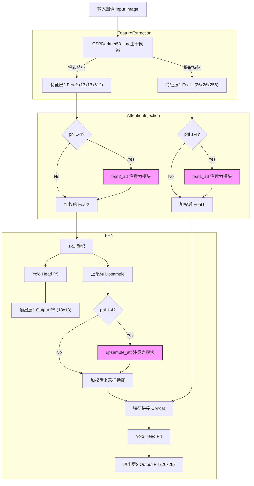

# 第三次学习汇报

## 一、深度学习——添加注意力机制

注意力机制的核心重点就是让网络关注到它更需要关注的地。一般而言，注意力机制可以分为通道注意力机制，空间注意力机制，以及二者的结合。

### 1. SENet（通道注意力机制）

- **核心定位**：专注于特征层的**通道维度**，通过赋予不同通道不同权重，让网络关注关键通道信息（2017 年 ImageNet 竞赛冠军方案）。
- 实现步骤：
  1. 对输入特征层进行全局平均池化，压缩空间维度；
  2. 经过两次全连接层（第一次降维、第二次恢复与输入通道数一致）；
  3. 用 Sigmoid 函数将输出归一化到 0-1 区间，得到各通道的权值；
  4. 将权值与原输入特征层逐元素相乘，完成通道注意力加权。
- **特点**：结构简洁，仅聚焦通道维度优化，是通道注意力的基础经典方案。
- **缺点：**SE注意力中只关注构建通道之间的相互依赖关系，忽略了空间特征。

### 2. CBAM（通道 + 空间注意力机制）

- **核心定位**：结合**通道注意力**和**空间注意力**，比单一通道注意力（如 SENet）效果更全面，同时关注 “哪些通道重要” 和 “哪些空间位置重要”。
- 实现步骤：
  - 通道注意力部分：对输入特征层分别做全局平均池化和全局最大池化，两者通过共享全连接层处理后相加，经 Sigmoid 得到通道权值，与原特征层相乘；
  - 空间注意力部分：对上述处理后的特征层，在每个特征点的通道维度取最大和平均值，堆叠后通过 1D 卷积（核大小为 3 或 7）调整通道数，再经 Sigmoid 得到空间权值，与特征层相乘。
- **特点**：双注意力协同，覆盖通道和空间两个维度，对关键区域的捕捉更精准。
- **缺点**：CBAM中引入了大尺度的卷积核提取空间特征，但忽略了长程依赖问题。

### 3. ECA（改进型通道注意力机制）

- **核心定位**：SENet 的优化版，同样聚焦通道注意力，但解决了 SENet 全连接层带来的 “低效” 和 “副作用” 问题。

- 实现步骤：

  1. 对输入特征层做全局平均池化；
  2. 去除 SENet 的全连接层，直接用 1D 卷积学习通道依赖（卷积核大小根据通道数自适应计算：`k=abs((log(channel,2)+b)/gamma)`）；
  3. 经 Sigmoid 得到通道权值，与原特征层相乘。

- **特点**：用 1D 卷积替代全连接层，简化结构、提升效率，同时保留了跨通道信息交互能力。

  

三者的核心差异：SENet（单通道注意力）→ CBAM（通道 + 空间双注意力）→ ECA（优化通道注意力，高效轻量化），均为 “即插即用” 模块，可嵌入图像处理网络的特征提取环节。

### 4. CA (通道注意力机制)

- **核心定位**：将位置信息嵌入到通道注意力中，能够同时捕获跨通道信息和方向感知的位置信息。

- **实现步骤：**

1. 全局压缩：对输入特征图沿空间维度做全局平均池化，将每个通道的二维特征压缩为 1 个数值，得到通道级全局特征。
2. 权重学习：用两层全连接层（先降维再升维）+ 非线性激活（ReLU+Sigmoid），学习各通道的权重系数（值在 0~1 之间）。
3. 加权增强：将学习到的通道权重与原始特征图逐通道相乘，完成特征加权。

## 二、手势识别项目改进

### 1. 增加数据集 1600个样本。

### 2. 在基础模型上增加四种注意力机制

#### (1) 注意力模块的定义 (nets/attention.py)
- se_block (SE Attention)
  
  - 代码位置 ：第 5-20 行
  - 原理 ：Squeeze-and-Excitation。通过全局平均池化压缩空间特征，然后通过全连接层学习通道间的权重，最后重新加权通道。
- cbam_block (CBAM Attention)
  
  - 代码位置 ：第 57-66 行
  - 原理 ：Convolutional Block Attention Module。结合了通道注意力（Channel Attention）和空间注意力（Spatial Attention），串行地对特征图进行精细化处理。
- eca_block (ECA Attention)
  
  - 代码位置 ：第 68-82 行
  - 原理 ：Efficient Channel Attention。SE 的改进版，去除了全连接层，改用 1D 卷积来捕获跨通道交互信息，效率更高。
- CA_Block (Coordinate Attention)
  
  - 代码位置 ：第 84-100+ 行
  - 原理 ：将位置信息嵌入到通道注意力中，能够同时捕获跨通道信息和方向感知的位置信息。
#### (2)注意力机制的添加 (nets/yolo_tiny.py)

1. **特征提取 (Backbone) ：**

- 图像经过 CSPDarknet53-tiny 主干网络，输出两个尺度的有效特征层：
  - Feat1 : 26x26x256 (P4)
  - Feat2 : 13x13x512 (P5)
2. **注意力注入点 1 & 2 (Attention Injection) ：**
- 在特征层刚刚被提取出来后，代码立即检查 phi 参数。
- 如果 1 <= phi <= 4 ， Feat1 和 Feat2 会分别通过对应的注意力模块 ( feat1_att 和 feat2_att )。
- 这一步增强了原始特征的表达能力。
3. **特征金字塔 (FPN) & 注入点 3 ：**
- Feat2 经过卷积处理后，一路生成大物体的预测结果 ( Output P5 )。
- 另一路进行 上采样 (Upsample) ，准备与 Feat1 融合。
- 关键点 ：在上采样之后，拼接之前，代码再次插入了注意力模块 ( upsample_att )。这有助于在上采样过程中保留和强化重要信息。
- 最后，处理过的上采样特征与处理过的 Feat1 进行拼接 ( Concat )，生成小物体的预测结果 ( Output P4 )。

3. 训练结果

#### （1）基础模型

#### （2）添加注意力机制

### 3. 结果展示

