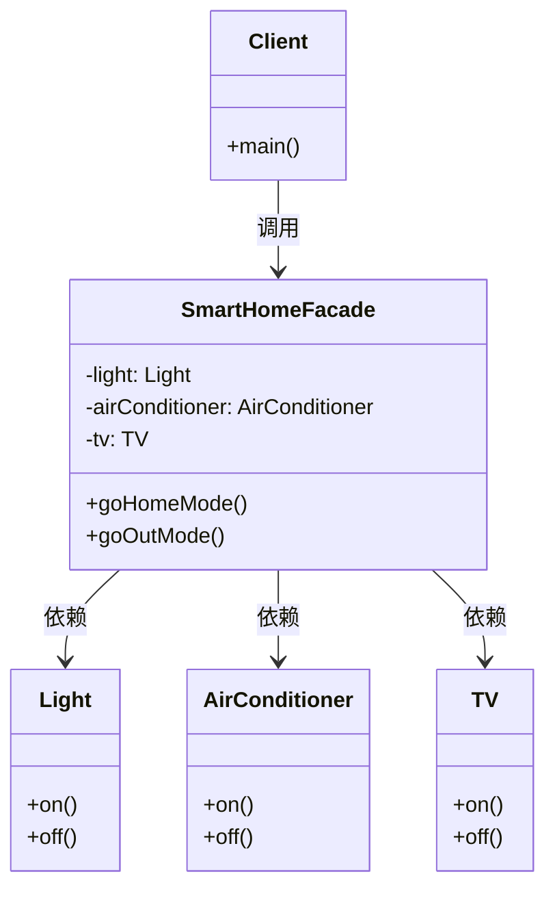
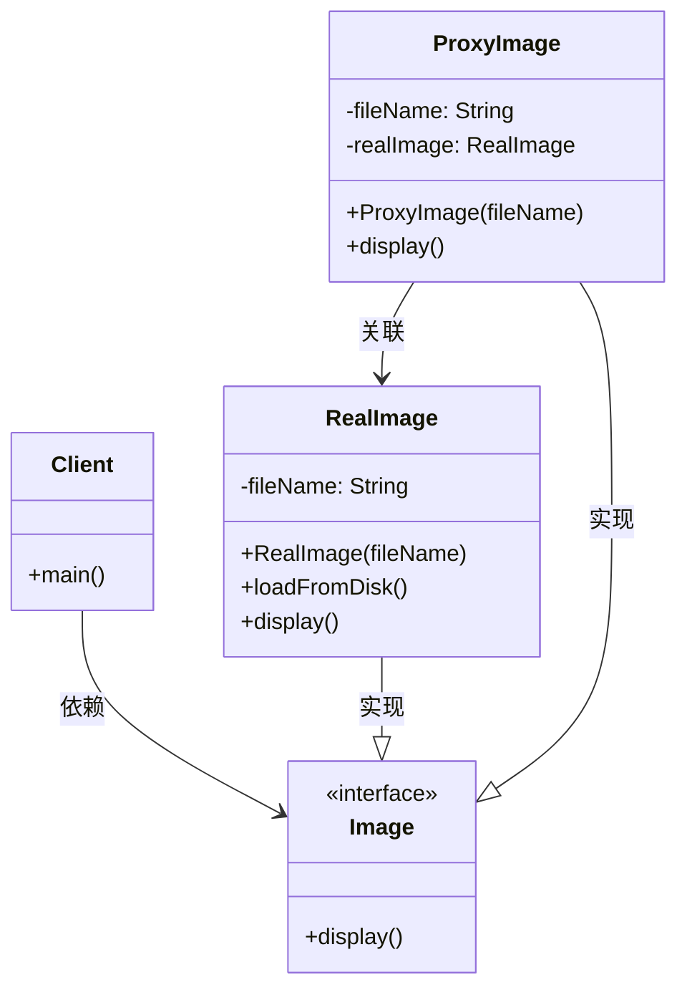
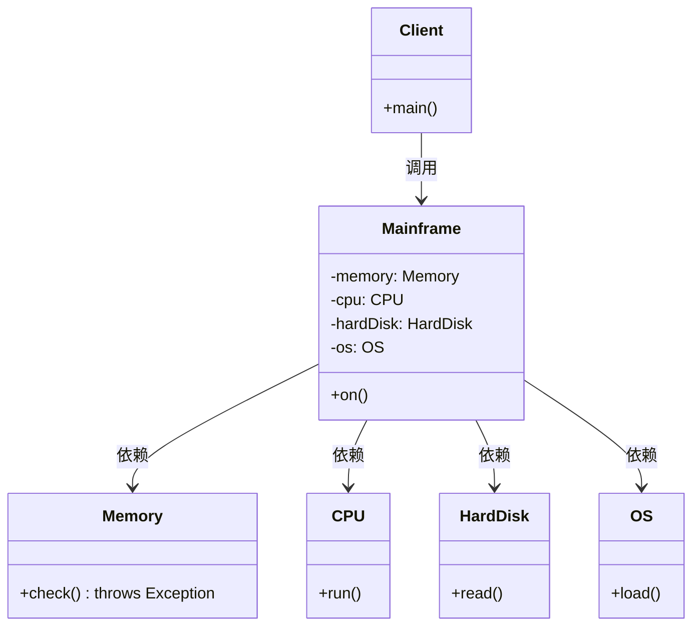

# 结构型模式（3）

## 1. 外观模式

### 实例：智能家居中控系统

**场景**：智能家居包含灯光、空调、电视三个子系统，用户通过 “智能家居中控” 一键实现 “回家模式”（开灯、开空调、开电视）或 “离家模式”（关灯、关空调、关电视），无需单独操作每个设备。

### 类图




### 代码实现

```java
// 子系统1：灯光
class Light {
    public void on() {
        System.out.println("灯光已打开");
    }
    public void off() {
        System.out.println("灯光已关闭");
    }
}

// 子系统2：空调
class AirConditioner {
    public void on() {
        System.out.println("空调已打开（26℃）");
    }
    public void off() {
        System.out.println("空调已关闭");
    }
}

// 子系统3：电视
class TV {
    public void on() {
        System.out.println("电视已打开（播放央视）");
    }
    public void off() {
        System.out.println("电视已关闭");
    }
}

// 外观类：智能家居中控
class SmartHomeFacade {
    // 持有子系统对象
    private Light light;
    private AirConditioner airConditioner;
    private TV tv;

    public SmartHomeFacade() {
        this.light = new Light();
        this.airConditioner = new AirConditioner();
        this.tv = new TV();
    }

    // 回家模式：封装子系统的复杂调用
    public void goHomeMode() {
        System.out.println("=== 执行回家模式 ===");
        light.on();
        airConditioner.on();
        tv.on();
    }

    // 离家模式
    public void goOutMode() {
        System.out.println("=== 执行离家模式 ===");
        light.off();
        airConditioner.off();
        tv.off();
    }
}

// 客户端
public class Client {
    public static void main(String[] args) {
        // 客户端仅与外观类交互，无需关注子系统细节
        SmartHomeFacade facade = new SmartHomeFacade();
        facade.goHomeMode();
        System.out.println("-------------------");
        facade.goOutMode();
    }
}
```

### 模式分析

- 角色：
  - 外观角色（`SmartHomeFacade`）：封装子系统的交互逻辑，提供统一接口。
  - 子系统角色（`Light`/`AirConditioner`/`TV`）：实现子系统的具体功能。
  - 客户角色（`Client`）：通过外观类访问子系统，无需直接操作子系统。
- **优点**：简化客户端调用、解耦客户端与子系统、降低代码维护成本。
- **缺点**：外观类可能成为 “上帝类”（职责过重），若子系统扩展频繁，需修改外观类（违反开闭原则）。
- **适用场景**：子系统接口复杂、客户端无需关注子系统内部细节、需要统一多个子系统的调用入口。

## 2. 代理模式

### 实例：图片加载虚拟代理

**场景**：大型图片（如高清壁纸）加载耗时较长，通过代理类实现**延迟加载**：只有当用户真正需要显示图片时，才创建真实图片对象并加载，避免初始化时的性能损耗。

### 类图



### 代码实现

```java
// 抽象主题：图片接口
interface Image {
    void display();
}

// 真实主题：真实图片（耗时加载）
class RealImage implements Image {
    private String fileName;

    public RealImage(String fileName) {
        this.fileName = fileName;
        // 初始化时加载图片（耗时操作）
        loadFromDisk();
    }

    // 模拟图片加载
    private void loadFromDisk() {
        System.out.println("加载图片：" + fileName + "（高清壁纸，耗时3秒）");
    }

    @Override
    public void display() {
        System.out.println("显示图片：" + fileName);
    }
}

// 代理主题：图片代理（延迟加载）
class ProxyImage implements Image {
    private String fileName;
    private RealImage realImage; // 持有真实主题的引用

    public ProxyImage(String fileName) {
        this.fileName = fileName;
    }

    @Override
    public void display() {
        // 仅当需要显示时，才创建真实图片对象
        if (realImage == null) {
            realImage = new RealImage(fileName);
        }
        realImage.display();
    }
}

// 客户端
public class Client {
    public static void main(String[] args) {
        // 初始化代理对象（未加载真实图片）
        Image image1 = new ProxyImage("壁纸1.jpg");
        Image image2 = new ProxyImage("壁纸2.jpg");

        System.out.println("第一次显示图片1：");
        image1.display(); // 触发真实图片加载
        System.out.println("-------------------");
        System.out.println("第二次显示图片1：");
        image1.display(); // 直接复用已加载的真实图片
        System.out.println("-------------------");
        System.out.println("显示图片2：");
        image2.display();
    }
}
```

### 模式分析

- 角色：
  - 抽象主题（`Image`）：定义真实主题和代理主题的共同接口。
  - 真实主题（`RealImage`）：实现抽象主题的核心功能，是代理的目标对象。
  - 代理主题（`ProxyImage`）：实现抽象主题，持有真实主题的引用，控制对真实主题的访问。
  - 客户角色（`Client`）：通过代理主题访问真实主题。
- **常见类型**：虚拟代理（延迟加载）、保护代理（权限控制）、远程代理（访问远程对象）、日志代理（记录调用日志）。
- **优点**：解耦客户端与目标对象、灵活控制访问、扩展目标对象的功能（无侵入）。
- **缺点**：增加系统复杂度、代理类会导致请求处理速度变慢。
- **适用场景**：需要控制对象访问、目标对象初始化耗时、需要为目标对象添加附加功能。

## 3. 模拟OS

### 需求分析

计算机主机（`Mainframe`）按下开机键（`on()`）后，需依次调用子系统的方法：

- 内存（`Memory`）：自检（`check()`），若自检失败则启动失败；
- CPU（`CPU`）：运行（`run()`）；
- 硬盘（`HardDisk`）：读取（`read()`）；
- 操作系统（`OS`）：载入（`load()`）。

通过**外观模式**封装上述流程，客户端仅调用主机的`on()`方法，无需关注子系统的交互细节；若某一步骤抛出异常，则主机启动失败。

### 类图



### 代码实现

```java
// 子系统1：内存
class Memory {
    // 自检方法，模拟可能抛出异常（如内存损坏）
    public void check() throws Exception {
        System.out.println("内存开始自检...");
        // 模拟自检失败：可注释此行测试成功场景
        // throw new Exception("内存损坏，自检失败！");
        System.out.println("内存自检通过");
    }
}

// 子系统2：CPU
class CPU {
    public void run() {
        System.out.println("CPU开始运行，频率3.0GHz");
    }
}

// 子系统3：硬盘
class HardDisk {
    public void read() {
        System.out.println("硬盘开始读取，转速7200转/分钟");
    }
}

// 子系统4：操作系统
class OS {
    public void load() {
        System.out.println("操作系统开始载入，当前系统：Windows 11");
    }
}

// 外观类：计算机主机
class Mainframe {
    // 持有所有子系统对象
    private Memory memory;
    private CPU cpu;
    private HardDisk hardDisk;
    private OS os;

    public Mainframe() {
        this.memory = new Memory();
        this.cpu = new CPU();
        this.hardDisk = new HardDisk();
        this.os = new OS();
    }

    // 开机方法：封装子系统的启动流程
    public void on() {
        System.out.println("=== 按下主机开机键 ===");
        try {
            memory.check();    // 内存自检
            cpu.run();         // CPU运行
            hardDisk.read();   // 硬盘读取
            os.load();         // 系统载入
            System.out.println("=== 计算机启动成功 ===");
        } catch (Exception e) {
            System.out.println("=== 计算机启动失败：" + e.getMessage() + " ===");
        }
    }
}

// 客户端
public class ComputerClient {
    public static void main(String[] args) {
        // 客户端仅调用主机的on()方法
        Mainframe mainframe = new Mainframe();
        mainframe.on();
    }

```

### 测试结果

**启动成功**


**启动失败**

