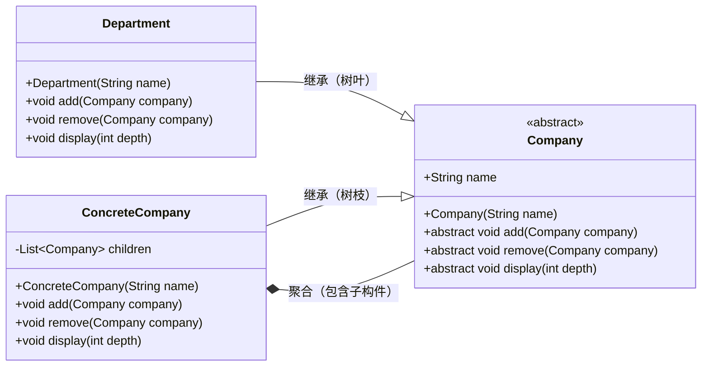
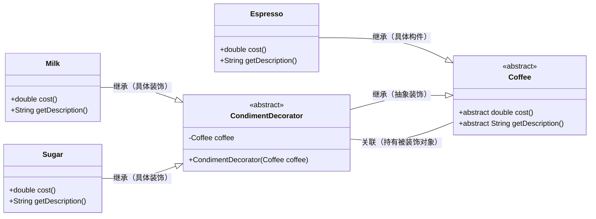
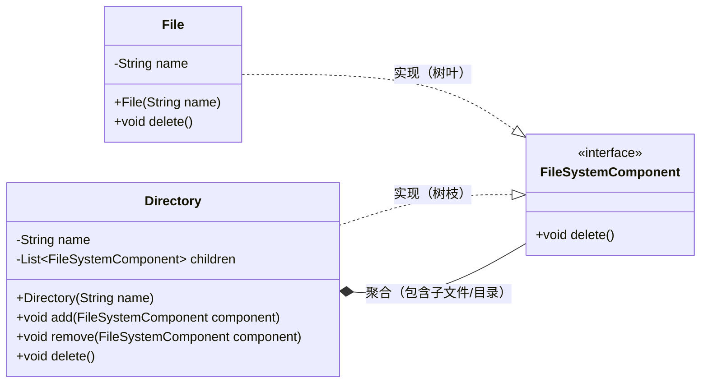

# 结构型模式（二）

## 1.试画出组合模式实例的结构图和实现代码，并对模式进行分析。

### 结构图



### 实现代码

```java
import java.util.ArrayList;  
import java.util.List;  

// 抽象构件：公司（统一接口）  
abstract class Company {  
    protected String name;  

    public Company(String name) {  
        this.name = name;  
    }  

    public abstract void add(Company company);   // 添加子构件  
    public abstract void remove(Company company); // 移除子构件  
    public abstract void display(int depth);     // 展示结构（depth表示层级）  
}  

// 树叶构件：部门（无下属）  
class Department extends Company {  
    public Department(String name) {  
        super(name);  
    }  

    @Override  
    public void add(Company company) {  
        throw new UnsupportedOperationException("部门不能添加子节点");  
    }  

    @Override  
    public void remove(Company company) {  
        throw new UnsupportedOperationException("部门不能移除子节点");  
    }  

    @Override  
    public void display(int depth) {  
        // 用"-"表示层级  
        System.out.println("-".repeat(depth) + name);  
    }  
}  

// 树枝构件：具体公司（总公司/分公司，有下属）  
class ConcreteCompany extends Company {  
    private List<Company> children = new ArrayList<>(); // 存储子构件  

    public ConcreteCompany(String name) {  
        super(name);  
    }  

    @Override  
    public void add(Company company) {  
        children.add(company);  
    }  

    @Override  
    public void remove(Company company) {  
        children.remove(company);  
    }  

    @Override  
    public void display(int depth) {  
        // 先展示自身，再递归展示所有子构件  
        System.out.println("-".repeat(depth) + name);  
        for (Company child : children) {  
            child.display(depth + 2); // 子层级+2  
        }  
    }  
}  

// 测试类  
public class CompositeDemo {  
    public static void main(String[] args) {  
        // 总公司  
        Company root = new ConcreteCompany("总公司");  
        // 分公司  
        Company branch = new ConcreteCompany("北京分公司");  
        // 部门  
        Company hr = new Department("人力资源部");  
        Company tech = new Department("技术部");  

        // 组装结构  
        root.add(branch);  
        branch.add(hr);  
        branch.add(tech);  

        // 展示结构（从层级0开始）  
        root.display(0);  
    }  
}  
```

### 模式分析

- 优势：
  1. 客户端可统一处理单个对象（如部门）和组合对象（如分公司），无需区分类型，简化代码。
  2. 符合开闭原则：新增树叶或树枝构件（如 "市场部" 或 "上海分公司"）时，无需修改现有代码。
- 劣势：
  1. 设计可能过于抽象，增加理解难度（如树叶构件需实现不支持的方法）。
  2. 限制严格：若需区分树叶和树枝的特殊行为，可能破坏接口统一性。

## 2.试画出装饰模式实例的结构图和实现代码，并对模式进行分析。

### 结构图



### 实现代码

```java
// 抽象构件：咖啡（定义核心功能）  
abstract class Coffee {  
    public abstract double cost();       // 价格  
    public abstract String getDescription(); // 描述  
}  

// 具体构件：浓缩咖啡（基础对象）  
class Espresso extends Coffee {  
    @Override  
    public double cost() {  
        return 25.0; // 基础价格  
    }  

    @Override  
    public String getDescription() {  
        return "浓缩咖啡";  
    }  
}  

// 抽象装饰类：调料装饰器（持有咖啡引用）  
abstract class CondimentDecorator extends Coffee {  
    protected Coffee coffee; // 被装饰的咖啡  

    public CondimentDecorator(Coffee coffee) {  
        this.coffee = coffee;  
    }  
}  

// 具体装饰类：牛奶（扩展功能）  
class Milk extends CondimentDecorator {  
    public Milk(Coffee coffee) {  
        super(coffee);  
    }  

    @Override  
    public double cost() {  
        return coffee.cost() + 5.0; // 基础价格+牛奶价格  
    }  

    @Override  
    public String getDescription() {  
        return coffee.getDescription() + " + 牛奶";  
    }  
}  

// 具体装饰类：糖（扩展功能）  
class Sugar extends CondimentDecorator {  
    public Sugar(Coffee coffee) {  
        super(coffee);  
    }  

    @Override  
    public double cost() {  
        return coffee.cost() + 2.0; // 基础价格+糖价格  
    }  

    @Override  
    public String getDescription() {  
        return coffee.getDescription() + " + 糖";  
    }  
}  

// 测试类  
public class DecoratorDemo {  
    public static void main(String[] args) {  
        // 基础咖啡  
        Coffee coffee = new Espresso();  
        System.out.println(coffee.getDescription() + "：" + coffee.cost() + "元");  

        // 加牛奶  
        coffee = new Milk(coffee);  
        System.out.println(coffee.getDescription() + "：" + coffee.cost() + "元");  

        // 再加糖  
        coffee = new Sugar(coffee);  
        System.out.println(coffee.getDescription() + "：" + coffee.cost() + "元");  
    }  
}  
```

### 模式分析

- 优势：
  1. 动态扩展：无需修改原有类，通过装饰器组合实现功能扩展（如咖啡可灵活加牛奶、糖等）。
  2. 替代继承：避免类爆炸（若用继承，"加牛奶的咖啡"、"加糖的咖啡" 等需单独定义类）。
- 劣势：
  1. 可能产生大量细粒度装饰类（如每种调料一个类），增加系统复杂度。
  2. 客户端需了解装饰器的组合逻辑，否则可能出错（如装饰顺序不影响结果，但需明确）。

## **3.**删除文件/目录。

### 类图



### 实现代码

```java
import java.util.ArrayList;  
import java.util.List;  

// 抽象构件：文件系统组件（统一删除接口）  
interface FileSystemComponent {  
    void delete(); // 删除自身  
}  

// 树叶构件：文件  
class File implements FileSystemComponent {  
    private String name;  

    public File(String name) {  
        this.name = name;  
    }  

    @Override  
    public void delete() {  
        System.out.println("删除文件：" + name);  
    }  
}  

// 树枝构件：目录  
class Directory implements FileSystemComponent {  
    private String name;  
    private List<FileSystemComponent> children = new ArrayList<>(); // 子文件/目录  

    public Directory(String name) {  
        this.name = name;  
    }  

    // 添加子组件  
    public void add(FileSystemComponent component) {  
        children.add(component);  
    }  

    // 移除子组件  
    public void remove(FileSystemComponent component) {  
        children.remove(component);  
    }  

    @Override  
    public void delete() {  
        // 先递归删除所有子组件（文件或子目录）  
        for (FileSystemComponent child : children) {  
            child.delete();  
        }  
        // 最后删除当前目录  
        System.out.println("删除目录：" + name);  
    }  
}  

// 测试类  
public class FileDeleteDemo {  
    public static void main(String[] args) {  
        // 创建文件  
        File file1 = new File("笔记.txt");  
        File file2 = new File("图片.png");  

        // 创建子目录及其中的文件  
        Directory subDir = new Directory("文档子目录");  
        subDir.add(new File("报告.pdf"));  

        // 创建根目录并组装结构  
        Directory rootDir = new Directory("根目录");  
        rootDir.add(file1);  
        rootDir.add(file2);  
        rootDir.add(subDir);  

        // 删除根目录（会递归删除所有内容）  
        rootDir.delete();  
    }  
}  
```

### 执行结果

```
删除文件：笔记.txt  
删除文件：图片.png  
删除文件：报告.pdf  
删除目录：文档子目录  
删除目录：根目录  
```

- **逻辑说明**：通过组合模式，目录（Directory）作为树枝构件，递归调用所有子组件（文件或子目录）的 delete () 方法，确保先删除内部所有内容，再删除自身，完全符合 "删除目录需先清空" 的需求。客户端只需调用根目录的 delete ()，无需区分文件和目录类型，简化了操作。