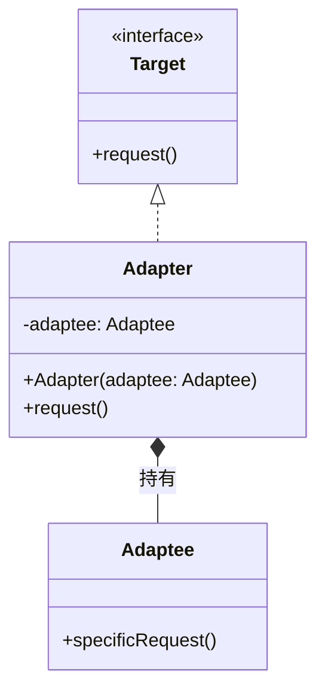
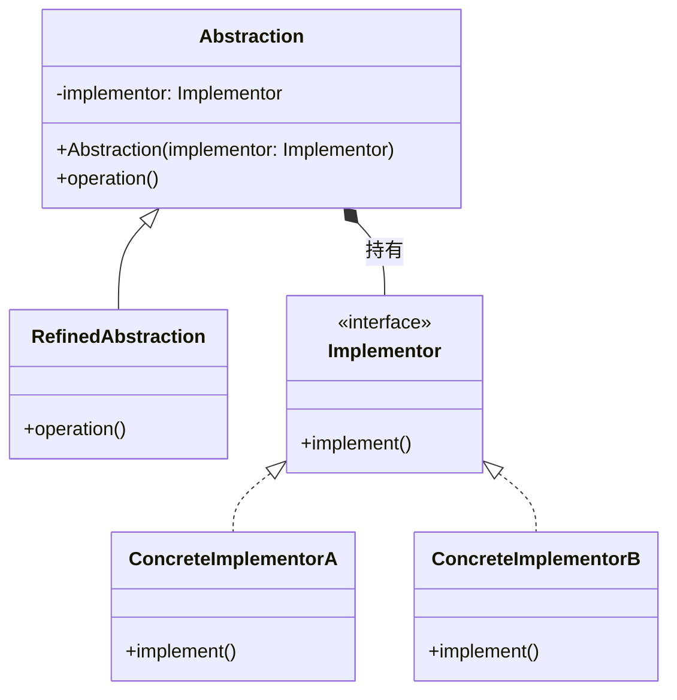
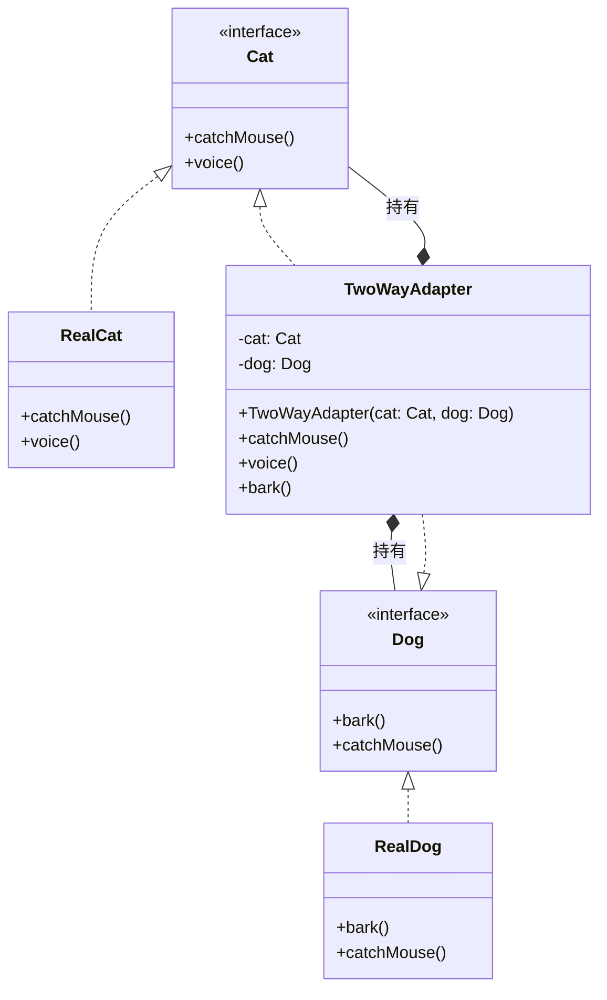

# 结构性模式（1）

## （1）**试画出适配器模式实例的结构图和实现代码，并对模式进行分析。**

### 结构图



### 实现代码

```java
// 目标接口（客户期望的接口）
interface Target {
    void request();
}

// 适配者（需要被适配的旧接口）
class Adaptee {
    public void specificRequest() {
        System.out.println("适配者：执行特定请求（旧接口方法）");
    }
}

// 适配器（将适配者转换为目标接口）
class Adapter implements Target {
    private Adaptee adaptee;

    public Adapter(Adaptee adaptee) {
        this.adaptee = adaptee;
    }

    @Override
    public void request() {
        // 适配逻辑：将目标接口方法转换为适配者的方法
        adaptee.specificRequest();
    }
}

// 客户端代码
public class Client {
    public static void main(String[] args) {
        Target target = new Adapter(new Adaptee());
        target.request(); // 调用目标接口，实际执行适配者的方法
    }
}
```

### 分析

- **意图**：将一个类的接口转换为客户期望的另一个接口，解决接口不兼容问题。

- **角色：**

  - 目标（Target）：客户需要的接口。
  - 适配者（Adaptee）：现有接口，需要被适配。
  - 适配器（Adapter）：实现 Target 接口，持有 Adaptee 实例，将 Target 方法转换为 Adaptee 方法。

- **优点：**

  - 复用现有类，无需修改源码（遵循开闭原则）。
  - 解耦目标接口与适配者，提高灵活性。

- **缺点：**

  - 增加系统复杂度（多一层适配）。

- **适用场景：**

  - 集成第三方组件（接口不匹配时）。

  - 重构旧系统（旧接口需适配新接口）。

## （2）试画出桥接模式实例的结构图和实现代码，并对模式进行分析。

### 结构图



### 实现代码

```java
// 实现化接口（抽象部分的实现维度）
interface Implementor {
    void implement();
}

// 具体实现A
class ConcreteImplementorA implements Implementor {
    @Override
    public void implement() {
        System.out.println("具体实现A：执行实现逻辑");
    }
}

// 具体实现B
class ConcreteImplementorB implements Implementor {
    @Override
    public void implement() {
        System.out.println("具体实现B：执行实现逻辑");
    }
}

// 抽象化（定义抽象部分的接口）
abstract class Abstraction {
    protected Implementor implementor;

    public Abstraction(Implementor implementor) {
        this.implementor = implementor;
    }

    public abstract void operation();
}

// 扩展抽象化（对抽象部分的扩展）
class RefinedAbstraction extends Abstraction {
    public RefinedAbstraction(Implementor implementor) {
        super(implementor);
    }

    @Override
    public void operation() {
        System.out.println("扩展抽象化：准备执行");
        implementor.implement(); // 调用实现化接口
    }
}

// 客户端代码
public class Client {
    public static void main(String[] args) {
        // 桥接：抽象部分与实现部分分离，可独立变化
        Implementor implA = new ConcreteImplementorA();
        Abstraction abstraction = new RefinedAbstraction(implA);
        abstraction.operation();

        Implementor implB = new ConcreteImplementorB();
        abstraction = new RefinedAbstraction(implB);
        abstraction.operation();
    }
}
```

### 分析

- **意图**：将抽象部分与实现部分分离，使两者可独立变化（解决多维度变化导致的类爆炸问题）。
- **角色：**
  - 抽象化（Abstraction）：定义抽象接口，持有 Implementor 引用。
  - 扩展抽象化（RefinedAbstraction）：扩展 Abstraction 的功能。
  - 实现化（Implementor）：定义实现部分的接口。
  - 具体实现化（ConcreteImplementor）：实现 Implementor 接口。
- **优点：**
  - 分离抽象与实现，两者可独立扩展（符合开闭原则）。
  - 减少子类数量（避免多维度组合导致的类爆炸）。
- **缺点：**
  - 增加系统复杂度（需理解抽象与实现的分离逻辑）。
- **适用场景：**
  - 一个类存在两个独立变化的维度（如 “形状” 和 “颜色”）。
  - 需在抽象和实现层之间增加灵活性。

## （3）**使用Java语言实现一个双向适配器实例，使得猫可以学狗叫，狗可以学猫抓老鼠，绘制相应类图并使用代码编程模拟。**

### 类图



### 实现代码

```java
// 猫接口
interface Cat {
    void catchMouse(); // 抓老鼠
    void voice();      // 叫声
}

// 真实猫
class RealCat implements Cat {
    @Override
    public void catchMouse() {
        System.out.println("猫：抓老鼠！");
    }

    @Override
    public void voice() {
        System.out.println("猫：喵喵~");
    }
}

// 狗接口
interface Dog {
    void bark();       // 叫声
    void catchMouse(); // 抓老鼠
}

// 真实狗
class RealDog implements Dog {
    @Override
    public void bark() {
        System.out.println("狗：汪汪！");
    }

    @Override
    public void catchMouse() {
        System.out.println("狗：不会抓老鼠...");
    }
}

// 双向适配器
class TwoWayAdapter implements Cat, Dog {
    private Cat cat;
    private Dog dog;

    public TwoWayAdapter(Cat cat, Dog dog) {
        this.cat = cat;
        this.dog = dog;
    }

    // 作为Cat：抓老鼠用猫的逻辑，叫声适配狗的bark
    @Override
    public void catchMouse() {
        cat.catchMouse();
    }

    @Override
    public void voice() {
        dog.bark(); // 猫学狗叫
    }

    // 作为Dog：叫声用狗的逻辑，抓老鼠适配猫的catchMouse
    @Override
    public void bark() {
        dog.bark();
    }

    @Override
    public void catchMouse() {
        cat.catchMouse(); // 狗学猫抓老鼠
    }
}

// 测试类
public class Main {
    public static void main(String[] args) {
        Cat realCat = new RealCat();
        Dog realDog = new RealDog();
        TwoWayAdapter adapter = new TwoWayAdapter(realCat, realDog);

        System.out.println("=== 猫学狗叫 ===");
        adapter.voice(); // 输出“狗：汪汪！”

        System.out.println("\n=== 狗学猫抓老鼠 ===");
        adapter.catchMouse(); // 输出“猫：抓老鼠！”
    }
}
```

### 说明

- 双向适配逻辑：适配器同时实现```Cat```和 ```Dog```接口，持有真实猫和狗的实例。

  - 当调用`Cat`接口的`voice()`时，实际执行`Dog`的`bark()`（猫学狗叫）。
  - 当调用`Dog`接口的`catchMouse()`时，实际执行`Cat`的`catchMouse()`（狗学猫抓老鼠）。
  
- **优势**：无需修改`RealCat`和`RealDog`的源码，通过适配器实现双向兼容，灵活扩展行为。

