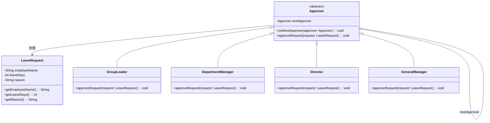
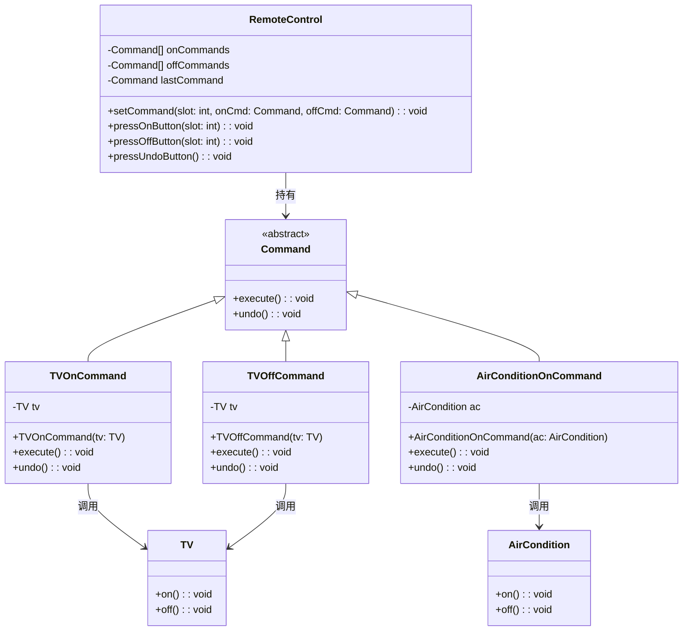

# 行为模式作业（1）

## 一. 职责链模式

以**请假审批流程**为例：员工请假时，请假天数不同，审批人不同。

- 请假≤1 天：小组长审批
- 1 天 < 请假≤3 天：部门经理审批
- 3 天 < 请假≤7 天：总监审批
- 请假 > 7 天：总经理审批

### 结构图




### 代码实现

```java
// 请假请求类：封装请求数据
class LeaveRequest {
    private String employeeName;
    private int leaveDays;
    private String reason;

    public LeaveRequest(String employeeName, int leaveDays, String reason) {
        this.employeeName = employeeName;
        this.leaveDays = leaveDays;
        this.reason = reason;
    }

    public String getEmployeeName() {
        return employeeName;
    }

    public int getLeaveDays() {
        return leaveDays;
    }

    public String getReason() {
        return reason;
    }
}

// 抽象审批者：定义处理请求的接口，包含后继者
abstract class Approver {
    protected Approver nextApprover;

    public void setNextApprover(Approver nextApprover) {
        this.nextApprover = nextApprover;
    }

    public abstract void approveRequest(LeaveRequest request);
}

// 小组长：处理≤1天的请假
class GroupLeader extends Approver {
    @Override
    public void approveRequest(LeaveRequest request) {
        if (request.getLeaveDays() <= 1) {
            System.out.println("小组长审批：员工" + request.getEmployeeName() + "请假" + request.getLeaveDays() + "天，理由：" + request.getReason());
        } else if (nextApprover != null) {
            nextApprover.approveRequest(request);
        }
    }
}

// 部门经理：处理1-3天的请假
class DepartmentManager extends Approver {
    @Override
    public void approveRequest(LeaveRequest request) {
        if (request.getLeaveDays() > 1 && request.getLeaveDays() <= 3) {
            System.out.println("部门经理审批：员工" + request.getEmployeeName() + "请假" + request.getLeaveDays() + "天，理由：" + request.getReason());
        } else if (nextApprover != null) {
            nextApprover.approveRequest(request);
        }
    }
}

// 总监：处理3-7天的请假
class Director extends Approver {
    @Override
    public void approveRequest(LeaveRequest request) {
        if (request.getLeaveDays() > 3 && request.getLeaveDays() <= 7) {
            System.out.println("总监审批：员工" + request.getEmployeeName() + "请假" + request.getLeaveDays() + "天，理由：" + request.getReason());
        } else if (nextApprover != null) {
            nextApprover.approveRequest(request);
        }
    }
}

// 总经理：处理>7天的请假
class GeneralManager extends Approver {
    @Override
    public void approveRequest(LeaveRequest request) {
        if (request.getLeaveDays() > 7) {
            System.out.println("总经理审批：员工" + request.getEmployeeName() + "请假" + request.getLeaveDays() + "天，理由：" + request.getReason());
        } else {
            System.out.println("无对应审批人，请假失败");
        }
    }
}

// 测试类
public class ChainOfResponsibilityTest {
    public static void main(String[] args) {
        // 创建审批者
        Approver groupLeader = new GroupLeader();
        Approver deptManager = new DepartmentManager();
        Approver director = new Director();
        Approver generalManager = new GeneralManager();

        // 设置职责链：小组长→部门经理→总监→总经理
        groupLeader.setNextApprover(deptManager);
        deptManager.setNextApprover(director);
        director.setNextApprover(generalManager);

        // 测试不同请假天数
        LeaveRequest request1 = new LeaveRequest("张三", 1, "感冒");
        LeaveRequest request2 = new LeaveRequest("李四", 5, "探亲");
        LeaveRequest request3 = new LeaveRequest("王五", 10, "旅游");

        groupLeader.approveRequest(request1);
        groupLeader.approveRequest(request2);
        groupLeader.approveRequest(request3);
    }
}
```

### 模式分析

| 角色                                               | 作用                                                         |
| -------------------------------------------------- | ------------------------------------------------------------ |
| **抽象处理者（Approver）**                         | 定义处理请求的接口，包含一个后继者引用，用于传递请求。       |
| **具体处理者（GroupLeader/DepartmentManager 等）** | 实现抽象处理者的接口，判断自身是否能处理请求，若不能则传递给后继者。 |
| **请求类（LeaveRequest）**                         | 封装请求的相关数据（如请假人、天数、理由），供处理者获取。   |

**优点**：

- 解耦请求发送者和接收者，发送者无需知道谁处理请求。
- 新增处理者只需实现抽象类，符合开闭原则。
- 可动态调整职责链的顺序和节点。

**缺点**：

- 请求可能因链中无处理者而无法被处理。
- 链过长时会影响请求处理效率。

## 二. 命令模式

以**智能遥控器控制家电**为例：遥控器的每个按键对应一个命令（如打开电视、关闭空调），遥控器作为调用者，家电作为接收者，命令对象封装具体操作。

### 结构图



### 代码实现

```java
// 抽象命令类
interface Command {
    void execute();
    void undo();
}

// 接收者：电视
class TV {
    public void on() {
        System.out.println("电视已打开");
    }

    public void off() {
        System.out.println("电视已关闭");
    }
}

// 接收者：空调
class AirCondition {
    public void on() {
        System.out.println("空调已打开");
    }

    public void off() {
        System.out.println("空调已关闭");
    }
}

// 具体命令：打开电视
class TVOnCommand implements Command {
    private TV tv;

    public TVOnCommand(TV tv) {
        this.tv = tv;
    }

    @Override
    public void execute() {
        tv.on();
    }

    @Override
    public void undo() {
        tv.off();
    }
}

// 具体命令：关闭电视
class TVOffCommand implements Command {
    private TV tv;

    public TVOffCommand(TV tv) {
        this.tv = tv;
    }

    @Override
    public void execute() {
        tv.off();
    }

    @Override
    public void undo() {
        tv.on();
    }
}

// 具体命令：打开空调
class AirConditionOnCommand implements Command {
    private AirCondition ac;

    public AirConditionOnCommand(AirCondition ac) {
        this.ac = ac;
    }

    @Override
    public void execute() {
        ac.on();
    }

    @Override
    public void undo() {
        ac.off();
    }
}

// 调用者：遥控器
class RemoteControl {
    private Command[] onCommands;
    private Command[] offCommands;
    private Command lastCommand; // 记录上一次执行的命令，用于撤销

    public RemoteControl() {
        onCommands = new Command[2]; // 假设遥控器有2个按键槽位
        offCommands = new Command[2];
        // 初始化空命令，避免空指针
        Command noCommand = new NoCommand();
        for (int i = 0; i < 2; i++) {
            onCommands[i] = noCommand;
            offCommands[i] = noCommand;
        }
        lastCommand = noCommand;
    }

    // 设置按键对应的命令
    public void setCommand(int slot, Command onCmd, Command offCmd) {
        onCommands[slot] = onCmd;
        offCommands[slot] = offCmd;
    }

    // 按下开按键
    public void pressOnButton(int slot) {
        onCommands[slot].execute();
        lastCommand = onCommands[slot];
    }

    // 按下关按键
    public void pressOffButton(int slot) {
        offCommands[slot].execute();
        lastCommand = offCommands[slot];
    }

    // 按下撤销按键
    public void pressUndoButton() {
        lastCommand.undo();
    }
}

// 空命令：用于初始化，避免空指针
class NoCommand implements Command {
    @Override
    public void execute() {}

    @Override
    public void undo() {}
}

// 测试类
public class CommandPatternTest {
    public static void main(String[] args) {
        // 创建接收者
        TV tv = new TV();
        AirCondition ac = new AirCondition();

        // 创建具体命令
        Command tvOn = new TVOnCommand(tv);
        Command tvOff = new TVOffCommand(tv);
        Command acOn = new AirConditionOnCommand(ac);

        // 创建调用者：遥控器
        RemoteControl remote = new RemoteControl();

        // 设置按键0：电视的开/关
        remote.setCommand(0, tvOn, tvOff);
        // 设置按键1：空调的开/关（这里空调关命令用空命令代替）
        remote.setCommand(1, acOn, new NoCommand());

        // 测试操作
        remote.pressOnButton(0); // 打开电视
        remote.pressUndoButton(); // 撤销：关闭电视
        remote.pressOnButton(1); // 打开空调
        remote.pressOffButton(0); // 关闭电视（此时电视已关，执行后无变化）
    }
}
```

### 模式分析

| 角色                           | 作用                                                         |
| ------------------------------ | ------------------------------------------------------------ |
| **抽象命令（Command）**        | 定义命令的执行和撤销接口，是所有具体命令的父类。             |
| **具体命令（TVOnCommand 等）** | 实现抽象命令接口，持有接收者引用，调用接收者的具体方法完成请求。 |
| **调用者（RemoteControl）**    | 持有命令对象，触发命令的执行（如按下按键），无需知道具体执行逻辑。 |
| **接收者（TV/AirCondition）**  | 执行具体的业务逻辑（如打开电视），是命令的实际执行者。       |
| **空命令（NoCommand）**        | 作为默认命令，避免空指针异常，属于命令模式的优化技巧。       |

**优点**：

- 解耦调用者和接收者，调用者无需知道接收者的具体实现。
- 支持命令的撤销、重做、队列化和日志记录。
- 新增命令只需实现抽象命令，符合开闭原则。

**缺点**：

- 命令类数量会随业务增加而增多，增加系统复杂度。

## 三. 命令集合模拟

### 需求分析

通过**ArrayList 存储命令对象**，模拟加法运算的多次撤销（Undo）和重做（Redo）：

- 加法命令：将当前数值加上指定数。

- Undo：撤销上一次加法操作（减去指定数）。

- Redo：重做上一次撤销的加法操作（重新加上指定数）。

- 需维护**命令列表**、**当前操作索引**，通过索引控制 Undo/Redo 的范围。

### 代码实现

```java
import java.util.ArrayList;
import java.util.List;

// 抽象命令类
interface Command {
    void execute();
    void undo();
}

// 接收者：计算器（处理加法/减法运算）
class Calculator {
    private int currentValue = 0; // 初始值为0

    // 加法运算
    public void add(int num) {
        currentValue += num;
    }

    // 减法运算（用于撤销加法）
    public void subtract(int num) {
        currentValue -= num;
    }

    // 获取当前值
    public int getValue() {
        return currentValue;
    }
}

// 具体命令：加法命令
class AddCommand implements Command {
    private Calculator calculator;
    private int num; // 要加的数

    public AddCommand(Calculator calculator, int num) {
        this.calculator = calculator;
        this.num = num;
    }

    @Override
    public void execute() {
        calculator.add(num);
    }

    @Override
    public void undo() {
        calculator.subtract(num);
    }
}

// 调用者：命令管理器（维护命令列表，实现Undo/Redo）
class CommandInvoker {
    private List<Command> commandList = new ArrayList<>();
    private int currentIndex = -1; // 当前操作的索引，初始为-1（无命令）

    // 执行新命令
    public void executeCommand(Command cmd) {
        // 如果当前索引不是最后一位，说明之前有撤销操作，需要删除后续的命令（避免redo混乱）
        if (currentIndex < commandList.size() - 1) {
            commandList.subList(currentIndex + 1, commandList.size()).clear();
        }
        cmd.execute();
        commandList.add(cmd);
        currentIndex++;
        System.out.println("执行加法命令，当前值：" + ((AddCommand) cmd).calculator.getValue());
    }

    // 撤销操作
    public void undo() {
        if (currentIndex >= 0) {
            Command cmd = commandList.get(currentIndex);
            cmd.undo();
            currentIndex--;
            System.out.println("撤销加法命令，当前值：" + ((AddCommand) cmd).calculator.getValue());
        } else {
            System.out.println("无可撤销的命令");
        }
    }

    // 重做操作
    public void redo() {
        if (currentIndex < commandList.size() - 1) {
            currentIndex++;
            Command cmd = commandList.get(currentIndex);
            cmd.execute();
            System.out.println("重做加法命令，当前值：" + ((AddCommand) cmd).calculator.getValue());
        } else {
            System.out.println("无可重做的命令");
        }
    }

    // 获取当前计算器的值
    public int getCurrentValue(Calculator calculator) {
        return calculator.getValue();
    }
}

// 测试类
public class UndoRedoTest {
    public static void main(String[] args) {
        Calculator calculator = new Calculator();
        CommandInvoker invoker = new CommandInvoker();

        // 执行三次加法命令
        invoker.executeCommand(new AddCommand(calculator, 5)); // 0+5=5
        invoker.executeCommand(new AddCommand(calculator, 3)); // 5+3=8
        invoker.executeCommand(new AddCommand(calculator, 2)); // 8+2=10

        // 两次撤销
        invoker.undo(); // 10-2=8
        invoker.undo(); // 8-3=5

        // 两次重做
        invoker.redo(); // 5+3=8
        invoker.redo(); // 8+2=10

        // 再撤销三次（超出范围）
        invoker.undo(); // 10-2=8
        invoker.undo(); // 8-3=5
        invoker.undo(); // 5-5=0
        invoker.undo(); // 无可撤销
    }
}
```

### 运行结果


### 模式分析

- **命令列表（commandList）**：存储所有执行过的加法命令，是 Undo/Redo 的数据源。
- **当前索引（currentIndex）**：标记当前执行到的命令位置，Undo 时索引减 1 并执行命令的 undo ()，Redo 时索引加 1 并执行命令的 execute ()。
- **新命令执行时的清理**：若执行新命令前有撤销操作（currentIndex < 列表末尾），需删除索引后的命令，避免重做时执行过期命令。
