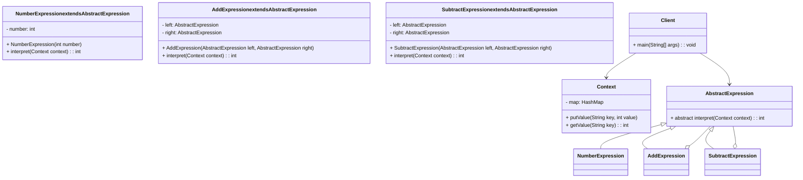

# 行为模式（2）

## 1. 解释器模式

### 实例

**简单算术表达式解释**：支持整数的加减运算（如 “10+5-3”），通过解释器模式解析表达式并计算结果。该场景符合解释器模式的核心适用场景 —— 存在固定语法规则（加减运算优先级一致，从左到右计算），需要解析并执行简单语法结构。

### 结构图




### 模式实现

```java
import java.util.HashMap;
import java.util.Map;

// 上下文类：存储表达式中的变量（本实例简化为直接存储数值，无变量）
class Context {
    private Map<String, Integer> map = new HashMap<>();

    // 存入变量名和值（本实例未使用变量，仅保留接口）
    public void putValue(String key, int value) {
        map.put(key, value);
    }

    // 获取变量值（本实例未使用变量）
    public int getValue(String key) {
        return map.get(key);
    }
}

// 抽象表达式类：定义解释方法
abstract class AbstractExpression {
    public abstract int interpret(Context context);
}

// 终结符表达式：处理数字（语法中的终结符）
class NumberExpression extends AbstractExpression {
    private int number;

    public NumberExpression(int number) {
        this.number = number;
    }

    @Override
    public int interpret(Context context) {
        return number; // 数字直接返回自身值
    }
}

// 非终结符表达式：处理加法（语法中的非终结符）
class AddExpression extends AbstractExpression {
    private AbstractExpression left; // 左表达式
    private AbstractExpression right; // 右表达式

    public AddExpression(AbstractExpression left, AbstractExpression right) {
        this.left = left;
        this.right = right;
    }

    @Override
    public int interpret(Context context) {
        // 解释左右表达式并返回加法结果
        return left.interpret(context) + right.interpret(context);
    }
}

// 非终结符表达式：处理减法（语法中的非终结符）
class SubtractExpression extends AbstractExpression {
    private AbstractExpression left;
    private AbstractExpression right;

    public SubtractExpression(AbstractExpression left, AbstractExpression right) {
        this.left = left;
        this.right = right;
    }

    @Override
    public int interpret(Context context) {
        return left.interpret(context) - right.interpret(context);
    }
}

// 客户端：构建表达式并执行解释
public class InterpreterClient {
    public static void main(String[] args) {
        Context context = new Context();

        // 构建表达式：10 + 5 - 3
        AbstractExpression expression = new SubtractExpression(
            new AddExpression(new NumberExpression(10), new NumberExpression(5)),
            new NumberExpression(3)
        );

        // 解释执行并输出结果
        int result = expression.interpret(context);
        System.out.println("表达式 10+5-3 的结果：" + result); // 输出 12
    }
}
```

### 模式分析

| 角色                                    | 作用说明                                                     | 本实例对应类 / 组件                                   |
| --------------------------------------- | ------------------------------------------------------------ | ----------------------------------------------------- |
| 抽象表达式（AbstractExpression）        | 定义所有表达式的公共解释接口（`interpret`方法），是解释器模式的核心抽象。 | `AbstractExpression`类                                |
| 终结符表达式（TerminalExpression）      | 处理语法中的 “终结符”（不可再分割的元素），直接返回自身解释结果。 | `NumberExpression`类（处理数字）                      |
| 非终结符表达式（NonterminalExpression） | 处理语法中的 “非终结符”（由多个表达式组合而成），递归解释子表达式。 | `AddExpression`、`SubtractExpression`（处理加减运算） |
| 上下文（Context）                       | 存储表达式解析所需的全局信息（如变量、配置），简化表达式的解释逻辑。 | `Context`类（本实例简化为无变量存储）                 |
| 客户端（Client）                        | 构建表达式树（组合终结符和非终结符表达式），调用解释方法执行解析。 | `InterpreterClient`类                                 |

**实例核心逻辑**：客户端通过组合`NumberExpression`（终结符）和`AddExpression`/`SubtractExpression`（非终结符）构建表达式树，调用根节点的`interpret`方法时，会递归解释所有子表达式，最终得到结果。

## 2. 迭代器模式

### 实例

**图书书架遍历**：书架（`BookShelf`）中存储多本图书（`Book`），通过迭代器遍历书架中的所有图书，不暴露书架的内部存储结构（如数组、列表）。该场景体现迭代器模式 “分离集合对象与遍历逻辑” 的核心思想。

### 结构图

```java
classDiagram
    class Iterator {
        + hasNext(): boolean
        + next(): Object
    }
    class BookShelfIterator implements Iterator {
        - bookShelf: BookShelf
        - index: int
        + BookShelfIterator(BookShelf bookShelf)
        + hasNext(): boolean
        + next(): Book
    }
    class Aggregate {
        + createIterator(): Iterator
    }
    class BookShelf implements Aggregate {
        - books: Book[]
        - size: int
        + BookShelf(int capacity)
        + addBook(Book book): void
        + getBookAt(int index): Book
        + getSize(): int
        + createIterator(): Iterator
    }
    class Book {
        - name: String
        + Book(String name)
        + getName(): String
    }
    class Client {
        + main(String[] args): void
    }

    Iterator <|-- BookShelfIterator
    Aggregate <|-- BookShelf
    BookShelfIterator o-- BookShelf
    BookShelf o-- Book
    Client --> BookShelf
    Client --> Iterator
```

### 模式实现

```java
// 抽象迭代器：定义遍历接口
interface Iterator {
    boolean hasNext(); // 是否还有下一个元素
    Object next(); // 获取下一个元素
}

// 抽象聚合：定义创建迭代器的接口
interface Aggregate {
    Iterator createIterator();
}

// 具体元素：图书
class Book {
    private String name;

    public Book(String name) {
        this.name = name;
    }

    public String getName() {
        return name;
    }
}

// 具体聚合：书架
class BookShelf implements Aggregate {
    private Book[] books; // 内部存储结构（数组）
    private int size; // 当前图书数量

    public BookShelf(int capacity) {
        this.books = new Book[capacity];
        this.size = 0;
    }

    // 添加图书
    public void addBook(Book book) {
        if (size < books.length) {
            books[size] = book;
            size++;
        }
    }

    // 获取指定位置的图书（仅暴露给迭代器，不对外公开数组）
    public Book getBookAt(int index) {
        return books[index];
    }

    // 获取当前图书数量
    public int getSize() {
        return size;
    }

    // 创建具体迭代器
    @Override
    public Iterator createIterator() {
        return new BookShelfIterator(this);
    }
}

// 具体迭代器：书架迭代器
class BookShelfIterator implements Iterator {
    private BookShelf bookShelf;
    private int index; // 当前遍历索引

    public BookShelfIterator(BookShelf bookShelf) {
        this.bookShelf = bookShelf;
        this.index = 0;
    }

    @Override
    public boolean hasNext() {
        // 索引小于图书数量则存在下一个元素
        return index < bookShelf.getSize();
    }

    @Override
    public Object next() {
        Book book = bookShelf.getBookAt(index);
        index++;
        return book;
    }
}

// 客户端：使用迭代器遍历书架
public class IteratorClient {
    public static void main(String[] args) {
        // 创建书架（容量5）并添加图书
        BookShelf bookShelf = new BookShelf(5);
        bookShelf.addBook(new Book("《设计模式》"));
        bookShelf.addBook(new Book("《Java编程思想》"));
        bookShelf.addBook(new Book("《数据结构》"));

        // 获取迭代器并遍历
        Iterator iterator = bookShelf.createIterator();
        while (iterator.hasNext()) {
            Book book = (Book) iterator.next();
            System.out.println("图书名称：" + book.getName());
        }
    }
}
```

### 模式分析

| 角色                           | 作用说明                                                     | 本实例对应类 / 组件       |
| ------------------------------ | ------------------------------------------------------------ | ------------------------- |
| 抽象迭代器（Iterator）         | 定义遍历集合的统一接口（`hasNext`、`next`），屏蔽不同集合的遍历差异。 | `Iterator`接口            |
| 具体迭代器（ConcreteIterator） | 实现抽象迭代器接口，包含遍历状态（如索引），负责具体的遍历逻辑。 | `BookShelfIterator`类     |
| 抽象聚合（Aggregate）          | 定义创建迭代器的接口，是集合对象的抽象。                     | `Aggregate`接口           |
| 具体聚合（ConcreteAggregate）  | 实现抽象聚合接口，存储元素，返回对应的具体迭代器。           | `BookShelf`类（存储图书） |
| 元素（Element）                | 集合中存储的具体对象。                                       | `Book`类（图书）          |

**实例核心逻辑**：书架（`BookShelf`）作为集合，内部用数组存储图书，但不对外暴露数组；迭代器（`BookShelfIterator`）通过书架提供的`getBookAt`和`getSize`方法遍历图书，客户端只需通过迭代器接口即可遍历，无需关心书架的内部存储结构。

## 教务管理系统

### 需求分析

- 核心对象：班级（`StudentClass`）、学生（`Student`）
- 功能：班级包含多个学生，使用 Java 内置迭代器（`Iterable`、`Iterator`）遍历学生，按年龄由大到小输出
- 关键技术：实现`Iterable`接口（让班级可被迭代）、使用`Comparator`排序学生列表、Java 内置`Iterator`接口

### 类图

```java
classDiagram
    class Student {
        - name: String
        - age: int
        + Student(String name, int age)
        + getName(): String
        + getAge(): int
    }
    class StudentClass implements Iterable~Student~ {
        - students: List~Student~
        + StudentClass()
        + addStudent(Student student): void
        + iterator(): Iterator~Student~
    }
    class Client {
        + main(String[] args): void
    }

    StudentClass o-- Student
    Client --> StudentClass
    Iterable~Student~ <|-- StudentClass
```

### 代码实现

```java
import java.util.ArrayList;
import java.util.Collections;
import java.util.Iterator;
import java.util.List;
import java.util.Comparator;

// 学生类：存储学生姓名和年龄
class Student {
    private String name;
    private int age;

    public Student(String name, int age) {
        this.name = name;
        this.age = age;
    }

    // getter方法
    public String getName() {
        return name;
    }

    public int getAge() {
        return age;
    }

    // 重写toString，方便输出
    @Override
    public String toString() {
        return "学生：姓名=" + name + "，年龄=" + age;
    }
}

// 班级类：实现Iterable接口，支持迭代
class StudentClass implements Iterable<Student> {
    private List<Student> students; // 存储学生的列表

    public StudentClass() {
        this.students = new ArrayList<>();
    }

    // 添加学生
    public void addStudent(Student student) {
        students.add(student);
    }

    // 重写iterator方法：返回按年龄降序的迭代器
    @Override
    public Iterator<Student> iterator() {
        // 1. 对学生列表按年龄降序排序
        Collections.sort(students, new Comparator<Student>() {
            @Override
            public int compare(Student s1, Student s2) {
                // 降序：s2.age - s1.age（升序为s1.age - s2.age）
                return s2.getAge() - s1.getAge();
            }
        });

        // 2. 返回列表的内置迭代器（排序后的列表）
        return students.iterator();
    }
}

// 客户端：测试遍历功能
public class StudentIteratorClient {
    public static void main(String[] args) {
        // 1. 创建班级并添加学生
        StudentClass class1 = new StudentClass();
        class1.addStudent(new Student("张三", 20));
        class1.addStudent(new Student("李四", 18));
        class1.addStudent(new Student("王五", 22));
        class1.addStudent(new Student("赵六", 19));

        // 2. 增强for循环（底层依赖Iterable接口的iterator方法）遍历
        System.out.println("班级学生按年龄降序排列：");
        for (Student student : class1) {
            System.out.println(student);
        }
    }
}
```


